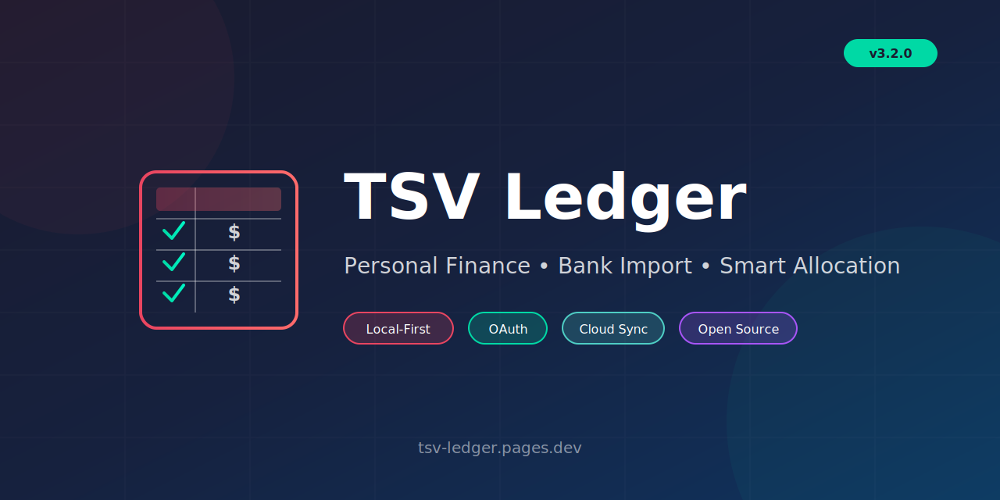

<p align="center">
  
</p>

<p align="center">
  <strong>Amazon Expense Allocation for Tax Prep</strong><br>
  <em>Allocate business vs. benefit expenses for accountants and tax professionals</em>
</p>

<p align="center">
  <a href="https://github.com/chf3198/tsv-ledger/actions/workflows/playwright.yml">
    
  </a>
  <a href="https://github.com/chf3198/tsv-ledger/releases">
    
  </a>
  <a href="LICENSE">
    
  </a>
  <a href="https://tsv-ledger.pages.dev">
    
  </a>
</p>

<p align="center">
  <a href="https://tsv-ledger.pages.dev">Live Demo</a> •
  <a href="#-features">Features</a> •
  <a href="#-quick-start">Quick Start</a> •
  <a href="docs/DESIGN.md">Documentation</a> •
  <a href="CONTRIBUTING.md">Contributing</a>
</p>

---

## ✨ Features

<table>
  <tr>
    <td width="50%">
      <h3>📥 Smart Import</h3>
      <p>Drag-and-drop Amazon Order History (CSV/ZIP) and Bank of America statements (DAT). Automatic parsing and categorization.</p>
    </td>
    <td width="50%">
      <h3>⚖️ Expense Allocation</h3>
      <p>Intuitive slider-based percentage split (0–100%) for each expense. Perfect for tax categorization.</p>
    </td>
  </tr>
  <tr>
    <td width="50%">
      <h3>📊 Dual-Column Board</h3>
      <p>Visual organization with Business vs Benefits columns. Split items appear proportionally in both.</p>
    </td>
    <td width="50%">
      <h3>🔐 OAuth Authentication</h3>
      <p>Secure sign-in with Google or GitHub via Cloudflare Workers. Optional cloud sync.</p>
    </td>
  </tr>
  <tr>
    <td width="50%">
      <h3>💾 Local-First</h3>
      <p>Works completely offline with localStorage. Your data stays on your device by default.</p>
    </td>
    <td width="50%">
      <h3>📤 CSV Export</h3>
      <p>Download categorized expenses as CSV for accounting software or tax preparation.</p>
    </td>
  </tr>
</table>

## 🚀 Quick Start

```bash
# Clone the repository
git clone https://github.com/chf3198/tsv-ledger.git
cd tsv-ledger

# Install dependencies
npm install

# Start development server
npm start
# Open http://localhost:8080
```

**Or try the [Live Demo](https://tsv-ledger.pages.dev)** — no installation required!

## 🧪 Testing

```bash
npm test          # Run all 40 Playwright E2E tests
npm run lint      # Check file sizes (≤100 lines)
npm run test:ui   # Interactive test runner
```

## 🏗️ Tech Stack

| Layer        | Technology         | Purpose                    |
| ------------ | ------------------ | -------------------------- |
| **UI**       | Alpine.js (15kb)   | Reactive state management  |
| **Styling**  | Pico CSS (10kb)    | Classless semantic styling |
| **Sliders**  | noUiSlider (12kb)  | Allocation interface       |
| **Testing**  | Playwright         | E2E browser testing        |
| **Hosting**  | Cloudflare Pages   | Static hosting + previews  |
| **API**      | Cloudflare Workers | OAuth + sessions           |
| **Database** | Cloudflare D1      | SQLite (optional sync)     |

**Zero frontend build step. No bundler. Just HTML, CSS, and JavaScript.**

## 📁 Project Structure

```
tsv-ledger/
├── index.html           # Alpine.js SPA entry point
├── css/
│   ├── shell.css        # App shell layout
│   └── app.css          # Component styles
├── js/
│   ├── app.js           # Alpine state machine
│   ├── amazon-parser.js # Order history parser
│   ├── boa-parser.js    # Bank statement parser
│   ├── auth.js          # OAuth client
│   └── storage.js       # localStorage CRUD
├── worker/              # Cloudflare Worker API
│   └── src/
│       ├── index.js     # API routes
│       ├── oauth.js     # OAuth handlers
│       └── session.js   # Session management
├── tests/               # Playwright E2E specs
└── docs/
    ├── DESIGN.md        # Architecture overview
    └── adr/             # Decision records
```

## 📖 Documentation

| Document                           | Description                                    |
| ---------------------------------- | ---------------------------------------------- |
| [DESIGN.md](docs/DESIGN.md)        | Architecture, data model, and design decisions |
| [ADRs](docs/adr/)                  | Architecture Decision Records                  |
| [CONTRIBUTING.md](CONTRIBUTING.md) | How to contribute                              |
| [CHANGELOG.md](CHANGELOG.md)       | Version history                                |
| [SECURITY.md](SECURITY.md)         | Security policy                                |

## 🤝 Contributing

Contributions are welcome! Please read our [Contributing Guide](CONTRIBUTING.md) to get started.

- 🐛 [Report bugs](https://github.com/chf3198/tsv-ledger/issues/new?template=bug_report.yml)
- ✨ [Request features](https://github.com/chf3198/tsv-ledger/issues/new?template=feature_request.yml)
- 💬 [Join discussions](https://github.com/chf3198/tsv-ledger/discussions)

## 📄 License

[MIT](LICENSE) © Curtis Franks

---

<p align="center">
  <sub>Built with ❤️ for Texas Sunset Venues</sub>
</p>
